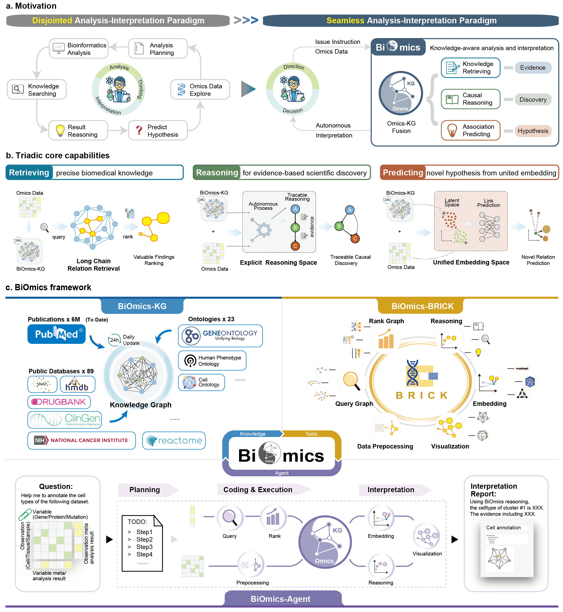

# **BiOmics**
 A Foundational Bio-Reasoning Agent for Traceable and Mechanistic Multi-omics Discovery

## Main purpose
While AI has automated bioinformatic workflows, biological interpretation remains fragmented and often disconnected from mechanistic insights. Existing AI is bifurcated between statistical "black-box" models that lack logical grounding and simple agents restricted to shallow knowledge retrieval. To bridge this divide, we present BiOmics, a foundational bio-reasoning agent enabling traceable, mechanistic discovery by integrating a 350M-relationship knowledge graph for grounding, the specialized interpretive toolchain, and an intelligent orchestrator for autonomous optimization. BiOmics introduces a novel dual-track architecture comprising a harmonized explicit reasoning space for grounded logic and a unified latent embedding space for high-dimensional association mapping. This architecture enables a novel "Retrieving-Reasoning-Predicting" paradigm, facilitating a cross-scale transition from raw multi-omics features to traceable and mechanistically grounded hypotheses at scale. 



## Architecture
BiOmics is composed of the daily-updated knowledge graph (BiOmics-KG), pluggable toolkit for interpretation (BiOmics-BRICK), and multi-agent system with reasoning ability (BiOmics-Agent). BiOmics system provides a foundation for combined reasoning and association prediction of data and knowledge.
- **BiOmics-KG** provides a high-quality semantic foundation for diverse downstream tasks by systematically integrating multi-source authoritative knowledge. Specifically, BiOmics-KG provides a foundational memory of 350 million daily-updated relations to ground inference and mitigate stochastic hallucinations
- **BiOmics-BRICK** offers a modular, pluggable toolchain to overcome bioinformatic interoperability bottlenecks. BiOmics-BRICK is composed of six pluggable tool modules: Data Preprocessing, Querying, Ranking, Reasoning, Representation Learning (Embedding), and Visualization.
- **BiOmics-Agent** relies on the universality and generalization capability of large language models (LLMs) to achieve autonomous interpretation and discovery of biological knowledge. Its main core functions can be summarized as six items: Requirement Parsing, Scheme Generation, Planning and Execution, Result Compilation, Human-Agent Interaction and Memory Retention.


## BiOmics Agent - Installation Guide

### Step 1: Clone the Repository

```bash
git clone -b master https://github.com/BGIResearch/BiOmics
```

### Step 2: Configure Environment Variables

Edit the `graph/brick_test_config.env` file and modify the following configuration:

```bash
# Change the project root path to your actual path
PROJECT_ROOT=/your/path/to/Biomics_agent
```

### Step 3: Create Conda Environment

Create a Python environment using the provided configuration file:

```bash
# Create environment using conda
conda env create -f biomics_environment.yml

# Activate the environment
conda activate biomics_agent
```

### Step 4: Start Docker Sandbox Container

#### 4.1 Download Docker Image

Download the pre-built image from Alibaba Cloud Container Registry:

```bash
# Download image (approximately 6.57GB)
docker pull crpi-b88i7r04wqgzpar4.cn-beijing.personal.cr.aliyuncs.com/biomics/biomics-agent:v6

# Optional: Tag the image
docker tag crpi-b88i7r04wqgzpar4.cn-beijing.personal.cr.aliyuncs.com/biomics/biomics-agent:v6 biomics_agent:v6
```

#### 4.2 Start the Sandbox Container

```bash
# Create a data directory under the project folder:
Biomics_agent/data

# Stop and remove old container (if exists)
docker rm -f my_code_sandbox

# Start new sandbox container
docker run -d \
  --name my_code_sandbox \
  --network="host" \
  -e PYTHONUNBUFFERED=1 \
  -v /your/path/to/Biomics_agent/data:/workspace/data \
  biomics_agent:v6 \
  jupyter kernelgateway \
  --KernelGatewayApp.ip=0.0.0.0 \
  --KernelGatewayApp.port=8888 \
  --KernelGatewayApp.auth_token="" \
  --JupyterWebsocketPersonality.list_kernels=True \
  --KernelManager.ip=0.0.0.0
```

**Notes:**
- Replace `/your/path/to/Biomics_agent/data` with the **absolute path** to your project's `data` directory
- The container will start Jupyter Kernel Gateway service on port `8888`
- Using `--network="host"` allows the container to share the host's network

**Verify container is running:**
```bash
# Check container status
docker ps | grep my_code_sandbox

# Test connection
curl http://127.0.0.1:8888/api
```

### Step 5: Run the Application

Start the NiceGUI Web application:

```bash
# Make sure you're in the project root directory
cd /your/path/to/Biomics_agent

# Activate the environment (if not already activated)
conda activate biomics_agent

# Start the application
python app_nicegui.py
```

Once the application starts, the browser will automatically open or you can visit:
```
http://localhost:8080
```

## Related work

**BiOmics** need **BiOmics-BRICK** as basis for tool like query knowledge graph, Visit https://github.com/caolei2-BGI/BiOmics_BRICK for detials of BiOmics-BRICK.


## Citing
```bibtex
@article {Cao2026.01.17.699830,
	author = {Cao, Lei and Li, Yuntain and Qin, Hua and Shang, Yanbang and Zhang, Yilin and Jovanovic, Bogdan and Djokic, Lazar and Xia, Tianyi and Hu, Luni and Hou, Haiyang and Ning, Xingxing and Lin, Li{\textquoteright}ang and Qiu, Hao and Deng, Ziqing and Li, Yuxiang and Zhang, Yong and Fang, Shuangsang},
	title = {BiOmics: A Foundational Agent for Grounded and Autonomous Multi-omics Interpretation},
	elocation-id = {2026.01.17.699830},
	year = {2026},
	doi = {10.64898/2026.01.17.699830},
	publisher = {Cold Spring Harbor Laboratory},
	abstract = {While AI has automated bioinformatic workflows, biological interpretation remains fragmented and often disconnected from mechanistic insights. Existing AI is bifurcated between statistical {\textquotedblleft}black-box{\textquotedblright} models that lack logical grounding and simple agents restricted to shallow knowledge retrieval. To bridge this divide, we introduce BiOmics, a foundational agent that synthesizes multi-omics data with adaptive knowledge for biological interpretation. BiOmics introduces a novel dual-track architecture comprising a harmonized explicit reasoning space for grounded logic and a unified latent embedding space for high-dimensional association mapping. This architecture enables a transformative {\textquotedblleft}Retrieving-Reasoning-Predicting{\textquotedblright} paradigm for purposeful, cross-scale inference traversing the biological hierarchy, from molecular variants to disease phenotypes. Empirical evaluations demonstrate that BiOmics surpasses state-of-the-art AI agents and specialized algorithms, markedly augmenting the granularity and depth of biological insights. Specifically, BiOmics exhibits unique superiority in uncovering indirect pathogenic variants, achieving reference-free cell annotation, and prioritizing drug repurposing candidates tailored to specific datasets. BiOmics further enriches the interpretive landscape of biological entities, leveraging its reasoning-grounded knowledge graph to uncover deep functional contexts. Ultimately, BiOmics provides a versatile engineering foundation to transition AI for Science from descriptive {\textquotedblleft}data fitting{\textquotedblright} to autonomous, knowledge-driven interpretation.Competing Interest StatementThe authors have declared no competing interest.National Natural Science Foundation of China, 32300526},
	URL = {https://www.biorxiv.org/content/early/2026/01/20/2026.01.17.699830},
	eprint = {https://www.biorxiv.org/content/early/2026/01/20/2026.01.17.699830.full.pdf},
	journal = {bioRxiv}
}
```